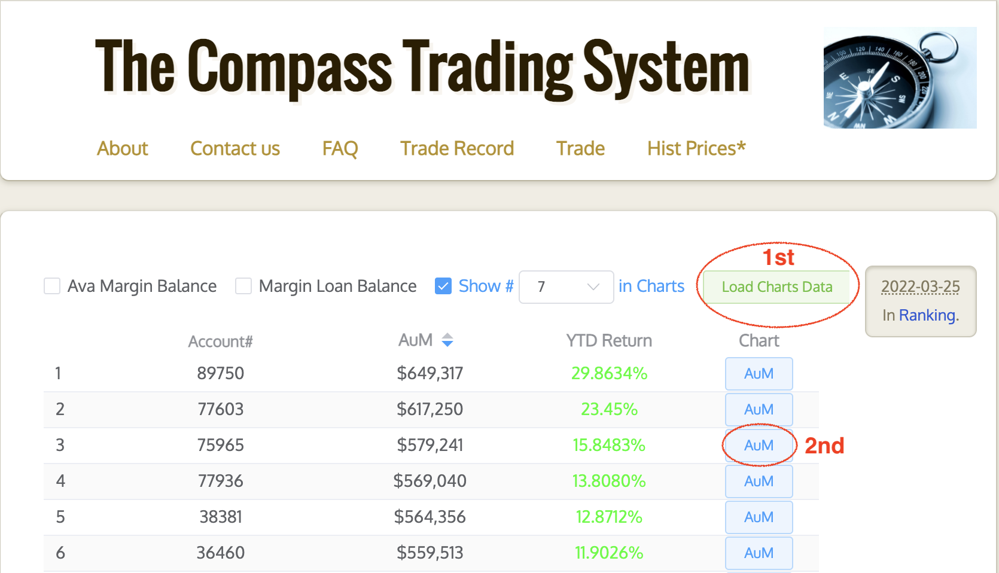
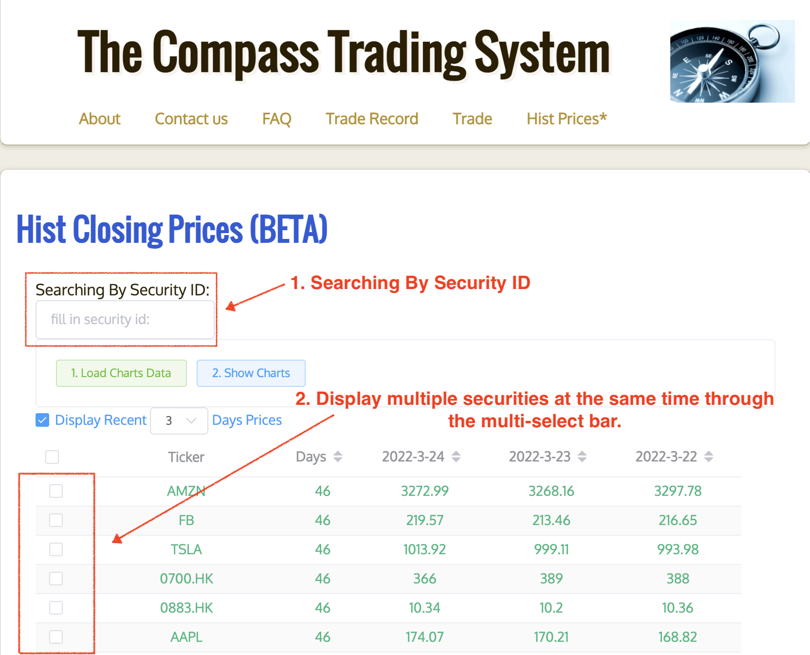
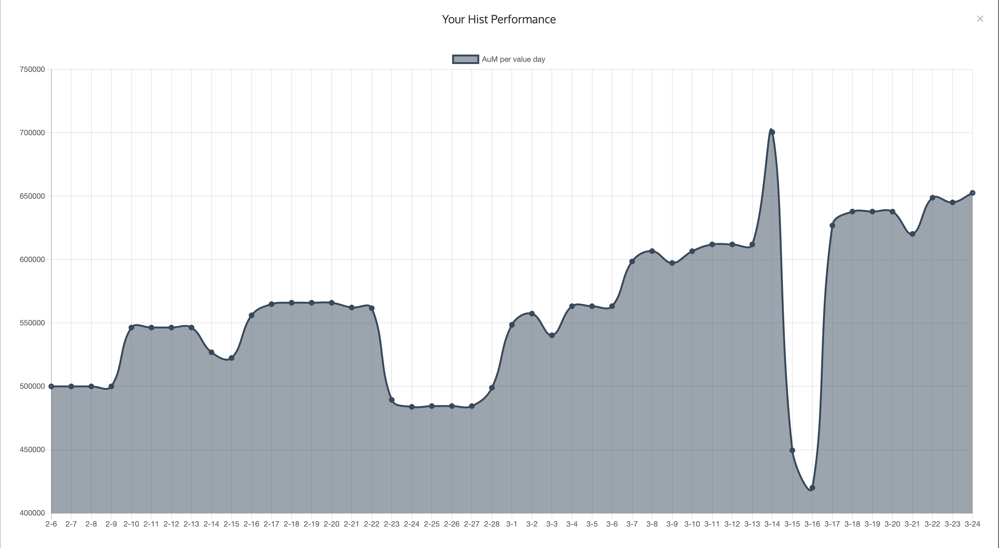
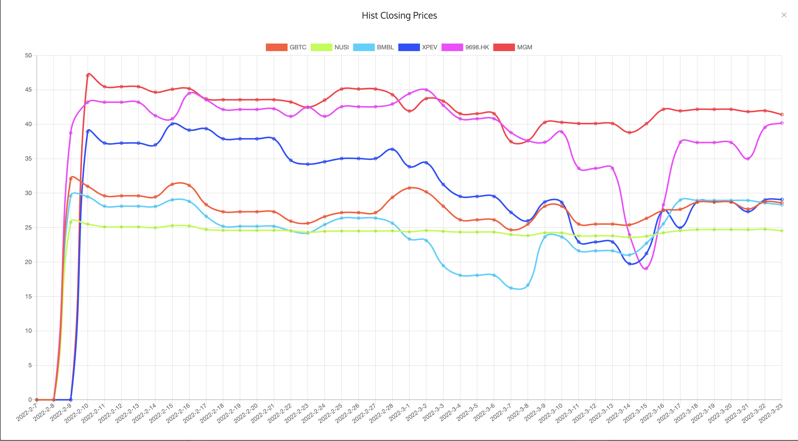

# compass: The COMPASS Trading System

The **[COMPASS Trading System](https://angold4.org/compass-ui/)**, which is a trading platform of the course B385F Investment Management offered by **[HKMU](https://www.hkmu.edu.hk)**, allowing college students to simulate trading stock, bond and options around the world.

This is the core front engine of that system, which is responsible to scrapping all real-time data from **[Yahoo Finance](https://finance.yahoo.com/)** and **[Bondsupermart](https://www.bondsupermart.com/bsm)**. And filtering and uploading them to the google servers for further processing.

We also provide an elegant ranking UI to the students that shows their past performance and also all past prices for stocks, bonds, and options being traded. As you can find in the **[CTS UI](https://angold4.org/compass-ui/)** and the source file in the **[compass-ui](https://github.com/a4org/compass-ui).**

## Some Screenshots

## Questions

### FAQ

Please check **[faq in compass-ui](https://angold4.org/compass-ui/faq.html)**.

### Issues

As this trading system will only start running every spring when the course **FINB385F Investment Management** start, your advices or issues will help us make this will help us improve this system.

## Technical Details
I use pure **C++** and the **[curl](https://curl.se/)** library to scraping and parsing all the data, some easy javascript to communicate with server. 

Currently, I plan to rewrite it using Rust, since the multi-threading version of **C++** doesn't works so well (some unknown bugs).
